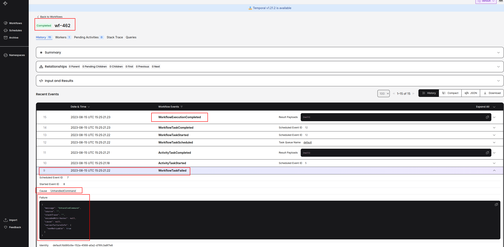

# ActivityRetry sample

This sample demonstrates how to retry an Activity if it returns an error.

From the root of the project, run the following command:

```bash
php ./app/app.php cancel-activity
```

The activity leads to `UnhandledCommand` but completed workflow

logs from CancelActivity in runtime:
```
samples-php-app-1       | 2023-08-15T15:25:21.195Z      INFO    server          [debug] Starting cancel activity.
samples-php-app-1       | 2023-08-15T15:25:21.198Z      INFO    server          [debug] created new workflowClient, get workflowID:wf-462
samples-php-app-1       | 2023-08-15T15:25:21.198Z      INFO    server          [debug] got workflow with ID:wf-462
samples-php-app-1       | 2023-08-15T15:25:21.210Z      INFO    server          [debug] cancelled workflow with ID:wf-462
```
A screenshot from the temporal admin panel:




```
{
  "message": "UnhandledCommand",
  "source": "",
  "stackTrace": "",
  "encodedAttributes": null,
  "cause": null,
  "serverFailureInfo": {
    "nonRetryable": true
  }
}
```